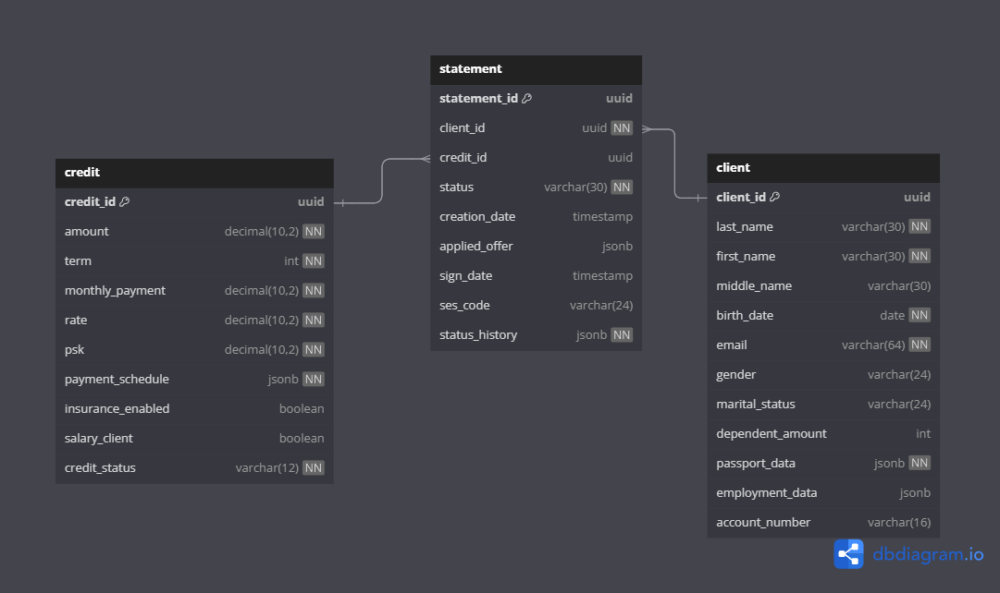
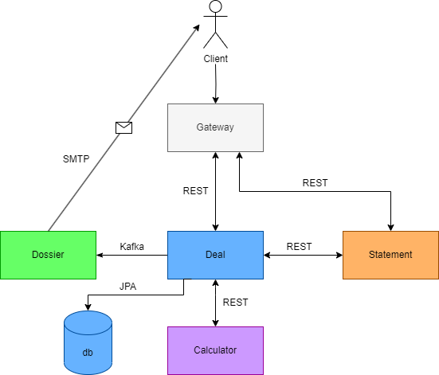

# credit-bank

Бэкенд-приложение с микросервисной архитектурой для банка.
Автоматизация скоринга, расчета и выдачи кредита.

## Основные функции
- Осуществление прескоринга заявки
- Осуществление скоринга и расчет 4х кредитных предложений
- Оформление и подтверждение заявки на получение кредита
- Хранение полной информации о клиенте, его заявках и выданных кредитах в базе данных
- Почтовая рассылка клиенту

## Стек технологий

- **Java** **21**
- **Spring Boot**
- **Hibernate**
- **OpenFeign**
- **Liquibase**
- **Lombok**
- **Apache Kafka**
- **Maven**
- **PostgreSQL**
- **H2**
- **JUnit**
- **Mockito**
- **Docker**
- **Swagger**

# Инструкция по запуску:

## 1  )  Запуск локально:

1)

- Для запуска с базой данных H2 в файле **start-app-h2.bat**, в текстовом редакторе указать host, port почтового
  сервера и username, password для указания почтового ящика, откуда будет приходить рассылка.
- Для запуска с базой данных PostgreSQL в файле **start-app-postgres.bat**, в текстовом редакаторе указать настройки
  почтового сервера, почты отправителя, настройки своей базы данных.

2) В командной строке выполнить:

- `docker-compose -f docker-compose-kafka.yaml up --build`

3) Запустить файл:
    - Для H2
        - `start-app-h2.bat`
    - Для PostgreSQL
        - `start-app-postgres.bat`

4) Для завершения работы программы запустить файл:

- `stop-app.bat`

## 2  ) Запуск контейнеров:

1) в файле **.env** указать значения всех переменных
2) Выполнить команду:
- `mvn clean package`
3) Выполнить команду:

- `docker-compose -f docker-compose-app.yaml up --build`

### Порты:
- **ms-calculator**: `2041`
- **ms-deal**:       `2042`
- **ms-statement**:  `2043`
- **ms-dossier**: `2044`
- **ms-Gateway**: `2045`
- **kafka**: `9092`
- **zookeeper**: `2181`
- **kafka ui**: `8084`
- **postgres**:`5434`

## Структура базы данных микросервиса deal:

  

## Архитектура приложения:

## Swagger:

- [MS-Calculator](./swagger/calculator-api.json)
- [MS-Deal](./swagger/deal-api.json)
- [MS-Statement](./swagger/statement-api.json)
- [MS-Gateway](./swagger/gateway-api.json)